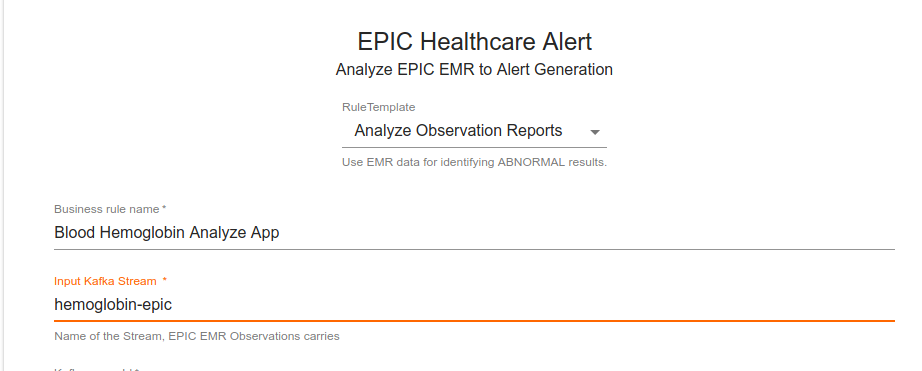
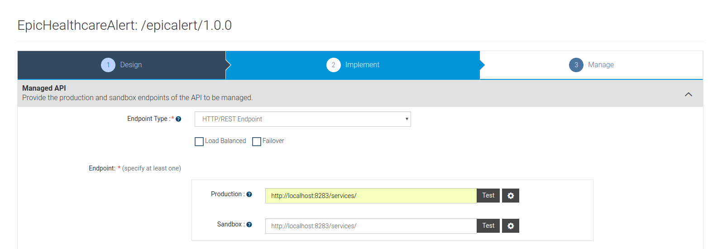
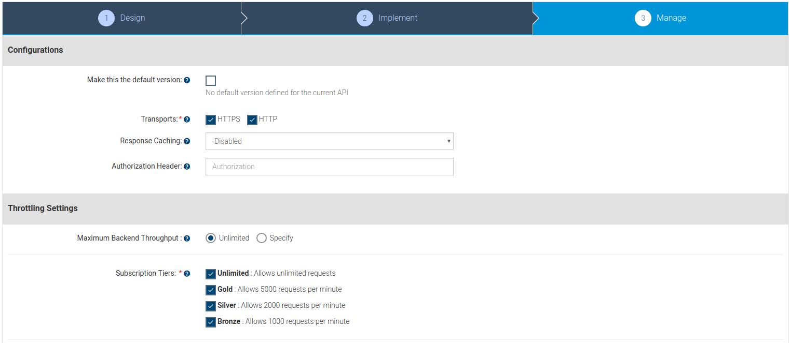
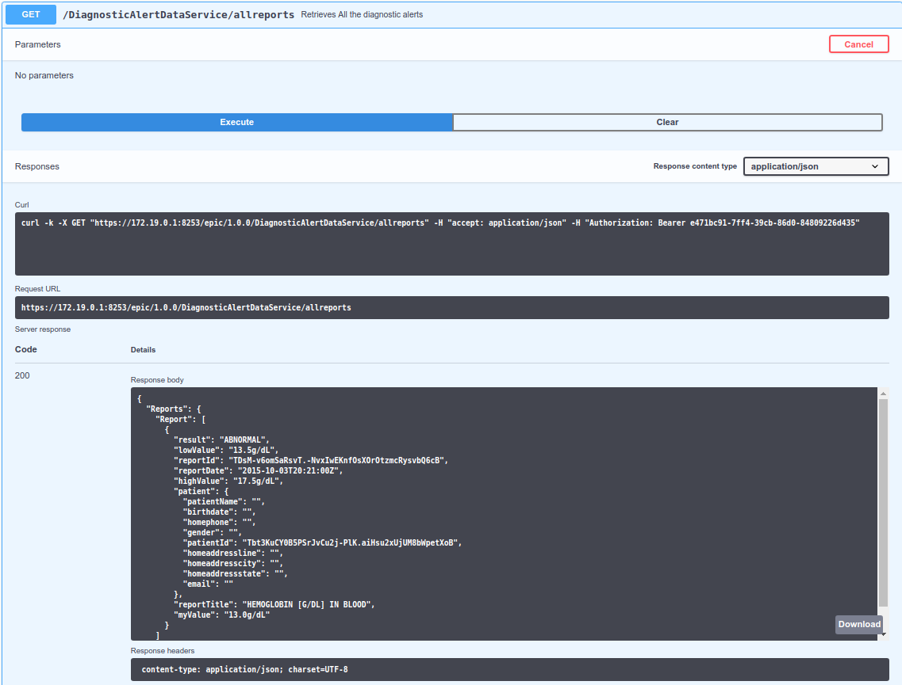

## Installation Guide

#### Prerequisites
 
* Docker - Follow https://docs.docker.com/install/ for docker installation 
* Docker Compose - Follow https://docs.docker.com/compose/install/ for Docker Compose Installation

#### Initial Setup

1. Clone the project. ${base_dir}=NotificationPlatform 

2. Head to docker-products directory and execute docker-compose

```bash
${base_dir}/dist/docker-products> docker-compose up
```
 

#### Testing

Note : Current Implementation only supports EPIC systems only.

EPIC SandBox Patients


| PatientId|PatientName|
| ------------- | ------------- |
| Tbt3KuCY0B5PSrJvCu2j-PlK.aiHsu2xUjUM8bWpetXoB | Jason Argonaut   |
| Ta1lSLg3glOZyQI.K3L08iF1-Tlb0E3TXC2L2CsyGMScB | Jason Argonaut|
| TUKRxL29bxE9lyAcdTIyrWC6Ln5gZ-z7CLr2r-2SY964B| Jessica Argonaut   |
|TJ0QiyZ6YNFjcofUWBjUzxfqxnmDX0tC036gBbh-cLwMB | Emily Williams|
|TwncfOQytqCYtmJKvdpDOSU7U1upj6s9crg-PFHQgSO0B|Emily Williams|
|Tt.ozkoEh2-Kc6KfzsnFFLb-bD-FGZJk6gCno4QlSN7oB|Emily Williams|

1. In your Web browser, navigate to the ESB profile's management console using the following URL: https://localhost:9443/carbon/

2. Insert one or more above Patient IDs to Employees Table.
Use EI Management Console or execute below curl command.

```
curl -X POST \http://wso2ei:8283/services/RDBMSDataService/patient \-H 'Content-Type: application/json' \-H 'Postman-Token: 8602e9b1-bfe6-4b53-8a23-0fcc6d63da0d' \-H 'cache-control: no-cache' \-d '{"_postpatient": {"patientId" : "Tbt3KuCY0B5PSrJvCu2j-PlK.aiHsu2xUjUM8bWpetXoB","shouldMonitor" : "1","EMR_PLATFORM" : "EPIC" }}'
```
 
3 . Then Select a Scheduled Task in EI console and Edit it. Lets select **EpicDataPollHbObservationTask**.
Set  Count  Interval(In seconds) to execute sequence. (default count:0 / Interval:3600s)


4 .In your Web browser, navigate to the SP dashboard using the following URL: https://localhost:9643/business-rules/ 

 
Create Business Rules for Each Observation Type using the **EPIC Healthcare Alert** Template.

##### Creating Observation Report Analyze Siddhi App 



Use Below Supported Input Kafka Streams : 
1. hemoglobin-epic
2. Medication-order-epic
3. cholesterol-epic
4. glucose-epic
5. potasium-in-blood-epic

##### Creating Alert Sending Siddhi App


Use Below Supported Output Kafka Streams :
1. bloodhemoglobin-epic-alert
2. medication-order-epic-alert
3. Bloodcholesterol-epic-alert 
4. bloodglucose-epic-alert 
5. bloodpotasium-epic-alert

* Sender Email : Set Email Sending Mailbox here.
* Sender UserName : The username of the Sender Email. This should be without @ and the latter part of the email address.
eg: test for test@test.com

* Sender Email Password: Password of the Sender Email
* Recipient Email : Email of the recipient.

##### Enable Email Event Publishing for Gmail in WSO2 Stream Processor
* Some email accounts required to enable 'access to less secure apps' option. (for gmail account you can enable it via)           
[https://myaccount.google.com/lesssecureapps](https://myaccount.google.com/lesssecureapps) 


 
* Make sure to Use appropriate Topic combination.
eg: [Input Stream]hemoglobin-epic => [Output Stream]bloodhemoglobin-epic-alert

5 . In your Web browser, navigate to the APIM  Publisher using the following URL: https://localhost:9453/publisher 

Lets create a API for Healthcare Alerts using the swagger provided.
Follow below steps to quickly deploy the Healthcare Alert API , publish it, subscribe to it, and invoke it.
 
1 . Open the API Publisher (https://<hostname>:9443/publisher) and sign in with admin/admin credentials.
2 . Exit from API creation tutorial by clicking the close icon(X) on top right corner.


3 . Click **ADD NEW API** button on top left corner and select **I have an Existing API** option.

Upload swagger.json and click **Start Creating** button (Swagger can be find at ${base_dir}/dist/wso2hc-1.0.0/repository/deployment/APIM_apis/swagger.json)

 

4 . Lets design API. Set those properties and click **Implement** button.  

* Name: **EpicHealthcareAlert**
* Context: **/epicalert**
* Version:**1.0.0**   


  
5 . Then select **Managed API**. Set Production and Sandbox URLs as below.
* Production: **http://localhost:8283/services/**
* Sandbox: **http://localhost:8283/services/**   



6 . Then click on **Manage** button. 

Edit Throttling Settings. Set **Subscription Tiers** to Unlimited,Gold,Silver,Bronze. Then **Save and Deploy** API.



7 . Sign in to the API Store (https://localhost:9453/store) with the admin/admin credentials and click on the EpicHealthcareAlert API.

Follow [WSO2 API Quick Start Guide](https://docs.wso2.com/display/AM260/Quick+Start+Guide) as a Tutorial for WSO2 APIM and subscription of APIs.

Subscribed to Default application and Try out APIS.



 
