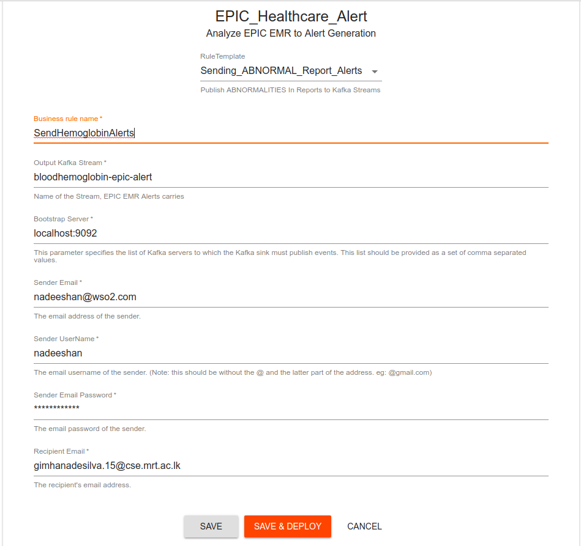

## Installation Guide

#### Prerequisites
 
* WSO2 EI 6.4.0
* WSO2 APIM 2.6.0
* WSO2 SP 4.3.0
* Apache Kafka and Zookeeper - Recommends: Kafka_2.11-2.0.0
* MySQL

#### Initial Setup

**NOTE: Currently Tested only in UBUNTU 16.04**

1. Follow Apache Kafka Quick start Guide for Kafka configuration. https://kafka.apache.org/quickstart

2. Install MySQL and set port 3306(default port)

3. Clone the project. ${base_dir}=NotificationPlatform 

4. Edit **${base_dir}/dist/wso2hc-1.0.0/bin/startup.properties** as follows  

```
EI_HOME=${PATH_TO_EI_HOME} 
SP_HOME=${PATH_TO_SP_HOME} 
APIM_HOME=${PATH_TO_APIM_HOME} 
DB_USER="${MYSQL_USER_NAME}"
DB_PASSWORD="${MYSQL_USER_PASSWORD}"
DB_HOST="${MYSQL_HOST_NAME}"
KAFKA_HOME=${PATH_TO_KAFKA_HOME}
```

5 . Start MySQL server
>mysql -h localhost -u ${MYSQL_USER_NAME} -p${MYSQL_USER_PASSWORD}


6 . Then head to bin directory and run configuration.sh.
>${base_dir}/dist/wso2hc-1.0.0/bin> sh configuration.sh 

7 . After configuration finished, execute init.sh. 
>${base_dir}/dist/wso2hc-1.0.0/bin> sh init.sh
 

#### Testing

Note : Current Implementation only supports EPIC systems only.

EPIC SandBox Patients


| PatientId|PatientName|
| ------------- | ------------- |
| Tbt3KuCY0B5PSrJvCu2j-PlK.aiHsu2xUjUM8bWpetXoB | Jason Argonaut   |
| Ta1lSLg3glOZyQI.K3L08iF1-Tlb0E3TXC2L2CsyGMScB | Jason Argonaut|
| TUKRxL29bxE9lyAcdTIyrWC6Ln5gZ-z7CLr2r-2SY964B| Jessica Argonaut   |
|TJ0QiyZ6YNFjcofUWBjUzxfqxnmDX0tC036gBbh-cLwMB | Emily Williams|
|TwncfOQytqCYtmJKvdpDOSU7U1upj6s9crg-PFHQgSO0B|Emily Williams|
|Tt.ozkoEh2-Kc6KfzsnFFLb-bD-FGZJk6gCno4QlSN7oB|Emily Williams|

1. In your Web browser, navigate to the ESB profile's management console using the following URL: https://localhost:9446/carbon/

2. Insert one or more above Patient IDs to Employees Table.
Use EI Management Console or execute below curl command.

```
curl -X POST \http://localhost:8283/services/RDBMSDataService/patient \-H 'Content-Type: application/json' \-d '{"_postpatient": {"patientId" : "Tbt3KuCY0B5PSrJvCu2j-PlK.aiHsu2xUjUM8bWpetXoB","shouldMonitor" : "1","EMR_PLATFORM" : "EPIC" }}'
```
 
3 . Then Select a ScheduledTask in EI console and Edit it. Lets select **EpicDataPollHbObservationTask**. 
Set  Count  Interval(In seconds) to execute sequence. (default count:0 / Interval:3600s)


4 .In your Web browser, navigate to the SP dashboard using the following URL: https://localhost:9643/business-rules/ 

 
Create Business Rules for Each Observation Type using the **EPIC Healthcare Alert** Template.

##### Creating Observation Report Analyze Siddhi App 


Use Below Supported Input Kafka Streams : 
1. hemoglobin-epic
2. Medication-order-epic
3. cholesterol-epic
4. glucose-epic
5. potasium-in-blood-epic

##### Creating Alert Sending Siddhi App



Use Below Supported Output Kafka Streams :
1. bloodhemoglobin-epic-alert
2. medication-order-epic-alert
3. Bloodcholesterol-epic-alert 
4. bloodglucose-epic-alert 
5. bloodpotasium-epic-alert

* Sender Email : Set Email Sending Mailbox here.
* Sender UserName : The username of the Sender Email. This should be without @ and the latter part of the email address.
eg: test for test@test.com

* Sender Email Password: Password of the Sender Email
* Recipient Email : Email of the recipient.

##### Enable Email Event Publishing for Gmail in WSO2 Stream Processor
* Some email accounts required to enable 'access to less secure apps' option. (for gmail account you can enable it via)           
[https://myaccount.google.com/lesssecureapps](https://myaccount.google.com/lesssecureapps) 


 
* Make sure to Use appropriate Topic combination.
eg: [Input Stream]hemoglobin-epic => [Output Stream]bloodhemoglobin-epic-alert

5 . In your Web browser, navigate to the APIM  Publisher using the following URL: https://localhost:9453/publisher 

Lets create a API for Healthcare Alerts using the swagger provided.
Follow below steps to quickly deploy the Healthcare Alert API , publish it, subscribe to it, and invoke it.
 
1 . Open the API Publisher (https://<hostname>:9443/publisher) and sign in with admin/admin credentials.
2 . Exit from API creation tutorial by clicking the close icon(X) on top right corner.


3 . Click **ADD NEW API** button on top left corner and select **I have an Existing API** option.

Upload swagger.json and click **Start Creating** button (Swagger can be find at ${base_dir}/dist/wso2hc-1.0.0/repository/deployment/APIM_apis/swagger.json)

 

4 . Lets design API. Set those properties and click **Implement** button.  

* Name: **EpicHealthcareAlert**
* Context: **/epicalert**
* Version:**1.0.0**   


  
5 . Then select **Managed API**. Set Production and Sandbox URLs as below.
* Production: **http://localhost:8283/services/**
* Sandbox: **http://localhost:8283/services/**   


6 . Then click on **Manage** button. 

Edit Throttling Settings. Set **Subscription Tiers** to Unlimited,Gold,Silver,Bronze. Then **Save and Deploy** API.


7 . Sign in to the API Store (https://localhost:9453/store) with the admin/admin credentials and click on the EpicHealthcareAlert API.

Follow [WSO2 API Quick Start Guide](https://docs.wso2.com/display/AM260/Quick+Start+Guide) as a Tutorial for WSO2 APIM and subscription of APIs.

Subscribed to Default application and Try out APIS.

